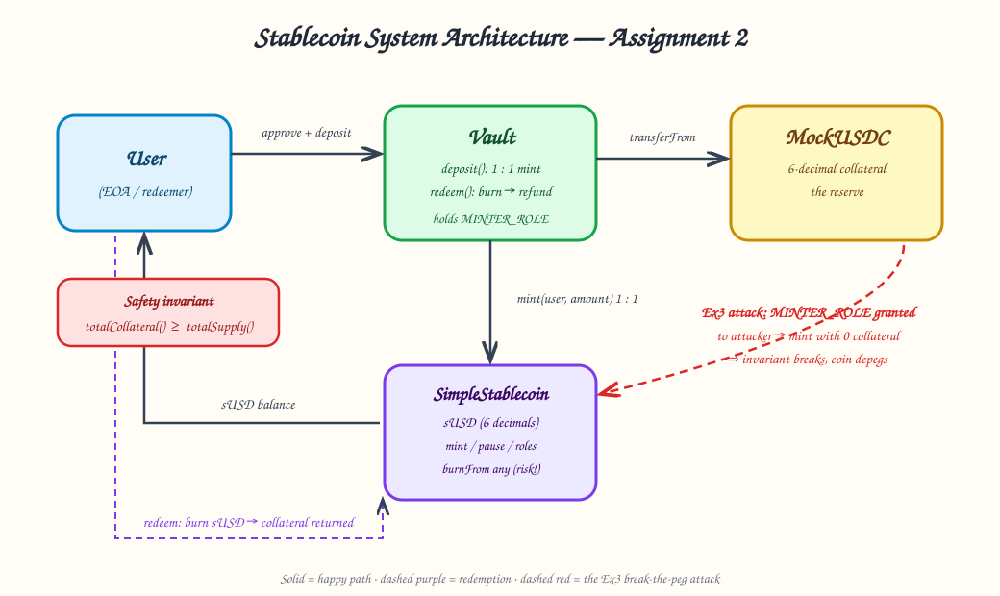
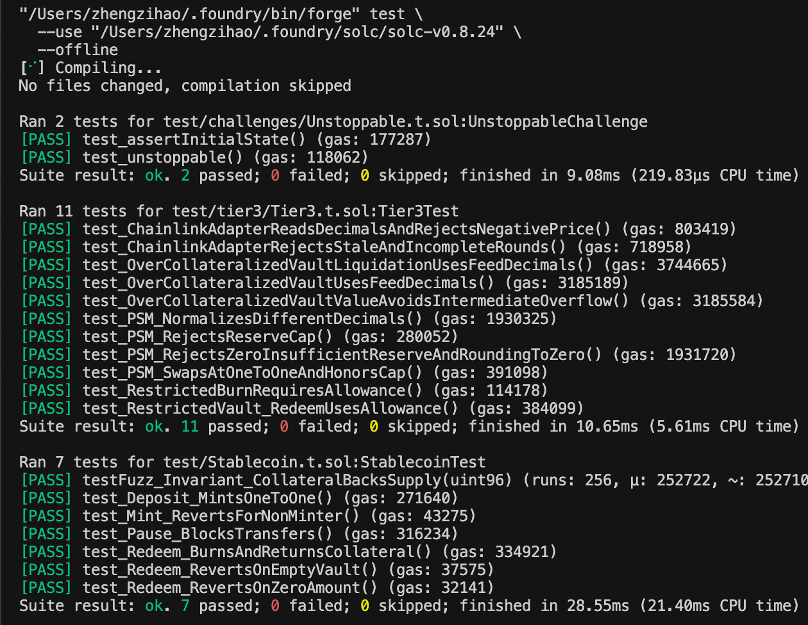
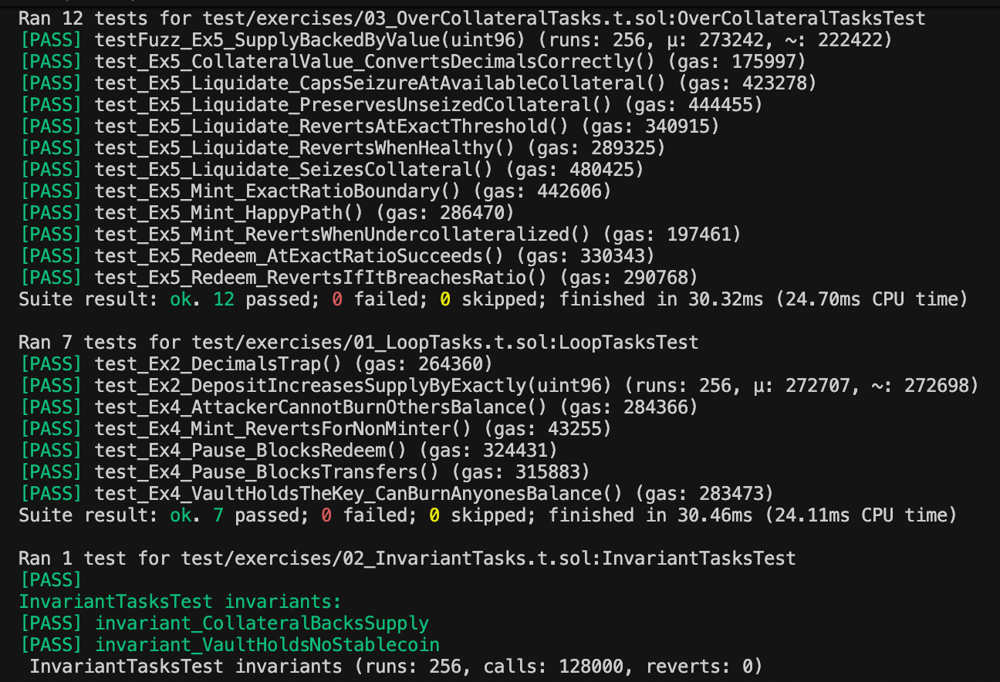
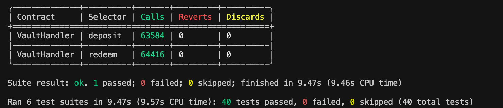
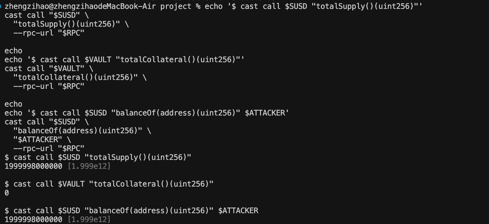

# COMP 7810A Assignment Two — Stablecoin Lab

This repository is the complete submission for Assignment Two:

**https://github.com/scnu001/stablecoin-for-zzh**

Everything a grader needs to check is on this page: the architecture diagram, the passing
test-suite screenshots, the Ex3 break-the-peg evidence, the Sepolia deployment
addresses with Etherscan links, and the written answers to all discussion
questions.

The lab builds and tests a fiat-collateralized stablecoin system. The central
mechanism is:

```text
user deposits collateral  ->  Vault holds collateral and mints sUSD
user returns sUSD         ->  Vault burns sUSD and returns collateral
```

The main safety property is that the vault's collateral must cover the
stablecoin supply. Ex3 deliberately breaks that property by granting minting
authority to an attacker and minting sUSD without collateral.

---

## Architecture diagram



The base vault is the only normal minter in the local three-contract system.
Solid arrows are the happy path (deposit/mint, redeem/burn), the dashed purple
path is redemption, and the dashed red path is the Ex3 attack that breaks the
backing invariant. A hand-drawn photo version is equally acceptable per the
assignment instructions; this rendered diagram carries the same content:

```text
                    approve + deposit
user ─────────────────────────────────────▶ Vault
 ▲                                           │
 │                                           │ transferFrom
 │                                           ▼
 │                                      MockUSDC reserve
 │                                           │
 │                                           │ mint 1:1
 │                                           ▼
 └────────────── sUSD balance ◀──── SimpleStablecoin
                │
                │ redeem: burn sUSD
                └────────────── Vault returns collateral
```

---

## Test evidence — `forge test` passing

Run the full suite from the repository root:

```bash
forge test --offline
```

If Foundry cannot find the locally cached compiler, use the same compiler
selection used to produce the evidence:

```bash
forge test --use "$HOME/.foundry/solc/solc-v0.8.24" --offline
```

The screenshots below are consecutive captures of the complete passing run.
`pass3.png` contains the final summary line and the invariant statistics.

### Full suite, part 1 (Ex7 + Tier 3 suites)



### Full suite, part 2 (core, Ex2/Ex4, Ex5, Ex6 suites)



### Full suite, part 3 — final summary: 40 tests passed, 0 failed, 0 skipped



Latest full run result:

- Core tests: 7 passed
- Ex2/Ex4 tests: 7 passed
- Ex5 tests: 12 passed
- Ex6 invariant suite: 256 runs, 128,000 handler calls, 0 reverts
- Ex7: 2 passed
- Tier 3 modules: 11 passed
- **Full suite: 40 passed, 0 failed, 0 skipped**

---

## Ex3 evidence — unbacked mint breaks the peg

This evidence was produced on a local Anvil chain only (no private key, not a
Sepolia deployment). After granting `MINTER_ROLE` to the attacker and minting
raw sUSD units without depositing collateral, the terminal showed:

```text
totalSupply:     1999998000000
totalCollateral: 0
attackerBalance: 1999998000000
```

The ERC-20 operations all succeed, but the backing invariant
`totalCollateral() >= totalSupply()` is false — this is the deliberate depeg
demonstration.



Local Anvil deployment used for the attack:

- MockUSDC: `0x5FbDB2315678afecb367f032d93F642f64180aa3`
- SimpleStablecoin: `0xe7f1725E7734CE288F8367e1Bb143E90bb3F0512`
- Vault: `0x9fE46736679d2D9a65F0992F2272dE9f3c7fa6e0`

---

## Tier 2 — Sepolia deployment (addresses + Etherscan)

Deployment network: Sepolia, chain ID `11155111`.
RPC used: `https://ethereum-sepolia-rpc.publicnode.com`.
The deployment script is `script/Deploy.s.sol`; it deploys the three required
base contracts (MockUSDC, SimpleStablecoin, Vault).

### Contract addresses and Etherscan links

| Contract | Address | Etherscan |
|---|---|---|
| MockUSDC | [`0xAe4f266A2fC2911e59f991539017dd1597c4d9B3`](https://sepolia.etherscan.io/address/0xAe4f266A2fC2911e59f991539017dd1597c4d9B3) | [verified](https://sepolia.etherscan.io/address/0xAe4f266A2fC2911e59f991539017dd1597c4d9B3) |
| SimpleStablecoin | [`0x831AFEced33D71471eD5f7124Ef9Fc344b78f815`](https://sepolia.etherscan.io/address/0x831AFEced33D71471eD5f7124Ef9Fc344b78f815) | [verified](https://sepolia.etherscan.io/address/0x831AFEced33D71471eD5f7124Ef9Fc344b78f815) |
| Vault | [`0x1900a4F371CC001eF6371b6F2Ee5c5b82cD18314`](https://sepolia.etherscan.io/address/0x1900a4F371CC001eF6371b6F2Ee5c5b82cD18314) | [verified](https://sepolia.etherscan.io/address/0x1900a4F371CC001eF6371b6F2Ee5c5b82cD18314) |

### Deployment transactions

- MockUSDC: [`0xf346dc4d25fdafe61db67889c6802cfa195df36fc1597ddb7463f1df0597ede8`](https://sepolia.etherscan.io/tx/0xf346dc4d25fdafe61db67889c6802cfa195df36fc1597ddb7463f1df0597ede8)
- SimpleStablecoin: [`0x38f65065cba8076f9f1ff54a28067bc8d9907800da73386ddc1e6f07da48b97c`](https://sepolia.etherscan.io/tx/0x38f65065cba8076f9f1ff54a28067bc8d9907800da73386ddc1e6f07da48b97c)
- Vault: [`0x67008d13794969484796cfa52af3ec93f31a9f66cadac9cfed01ea03f2631715`](https://sepolia.etherscan.io/tx/0x67008d13794969484796cfa52af3ec93f31a9f66cadac9cfed01ea03f2631715)

### Verification status

All three contracts are verified on both Etherscan and Sourcify (`forge
verify-check` returned `already verified`, exit code `0`, for each).

---

## Discussion questions — written answers

The same content lives in `STUDENT-QUESTIONS.md`; it is reproduced here so the
README is self-contained.

### A. Permission design

**A1.** The vault holds `MINTER_ROLE`, so it can `burn` any user's balance.
Explain why that is a risk, then write out how you would change `Vault` and
`SimpleStablecoin` to remove it.

`MINTER_ROLE` is more powerful than its name suggests in this lab: the same
function that allows the vault to mint also allows it to burn from any address.
If the vault is exploited, misconfigured, or upgraded maliciously, an attacker
controlling that path can destroy a user's sUSD without the user's approval.
That is a direct custody and governance risk, even though burning is normally
used to redeem collateral.

I would separate minting from user-authorized burning. `SimpleStablecoin`
should expose `mint(address,uint256)` only to a narrowly controlled minter
role, but its burn function should either be `burn(uint256)` and burn only
`msg.sender`, or be `burnFrom(address,uint256)` and require an ERC-20 allowance
from the account being burned. `Vault.redeem` would call `stable.burn(amount)`
while impersonating the redeemer as `msg.sender`, so the vault would no longer
need permission to burn arbitrary balances. If a protocol-level liquidation
needs a third-party burn, I would add a separate, explicitly governed
`LIQUIDATOR_ROLE` with a position-specific authorization and a maximum amount,
rather than reusing unrestricted mint authority. Events, timelocks, multisig
approval, and emergency revocation should protect role changes.

**A2.** In this contract `DEFAULT_ADMIN_ROLE`, `MINTER_ROLE` and `PAUSER_ROLE`
all go to the same address. How would you split them in production, and who
holds each?

In production I would not give all three roles to one externally owned account.
The `DEFAULT_ADMIN_ROLE` should belong to a multisig or a timelocked governance
contract. It controls role membership and therefore deserves the strongest
operational protection, including an emergency process and delayed changes
visible on-chain.

`MINTER_ROLE` should belong to the vault or issuance module, but only after
deployment has been reviewed and its parameters are fixed or governed. If there
are several minting routes, each should have its own bounded role or
capability. The minter must not automatically be able to change its own
permissions. Mint limits, collateral checks, and monitoring should provide a
second line of defence.

`PAUSER_ROLE` should be held by a separate security or incident-response
multisig with a shorter response path. It may need to pause quickly, but it
should not be able to grant itself minting power or rewrite the system. In some
designs I would split pause powers further: one role pauses transfers, another
pauses minting, and redemption remains available unless the collateral or
accounting system is actually unsafe. All role addresses should be documented,
monitored, and rotated through a timelocked process. Separation limits the
blast radius of a stolen key and makes collusion between independent operators
harder.

### B. Pausing and redemption

**B1.** `_update` is the single entry point for every balance change, so
`pause()` freezes transfers, minting and redemption together. If you wanted
"pause transfers but **allow redemption**", how would you change it? Give the
approach — full code not required.

I would stop using one unconditional `whenNotPaused` guard on the ERC-20
`_update` path. The token needs to distinguish transfer/mint operations from
redemption burns. One approach is to keep ordinary transfers blocked while
paused, but let the vault call a dedicated redemption function on the
stablecoin, such as `burnForRedemption(address user,uint256 amount)`. That
function would be restricted to the vault, verify that the caller is an
approved redemption module, and use an internal burn path that does not
inherit the transfer pause. The vault would then return collateral only after
the burn succeeds.

Another approach is to add a narrowly scoped pause mode rather than a boolean:
`normal`, `transfers paused`, and `all operations paused`. The `_update` hook
could reject transfers and ordinary minting when the first mode is active,
while the redemption function checks only whether the system is in the
emergency mode that truly requires redemptions to stop. I would not bypass all
pause checks globally, because that would let arbitrary users transfer or mint
during an incident. The exception must be callable only by the vault, emit a
redemption event, and be covered by tests proving that transfer and mint remain
blocked while a solvent user can still exit.

**B2.** In 2008, when a money-market fund "broke the buck", redemptions were
frozen for days. In 2023 USDC depegged to $0.87 after a reserve bank failed,
but redemptions were **not** shut. Compare the two responses — what does
closing the redemption channel, or leaving it open, do to a stablecoin?

Freezing redemption protects the remaining reserve from a run, but it also
removes the strongest mechanism users have to exchange the token for
collateral. In a crisis, that can turn a temporary loss of confidence into a
persistent discount: holders cannot arbitrage the coin back to its backing, and
users who need liquidity are trapped. The 2008 money-market-fund response
prioritized stopping withdrawals while the portfolio was being valued and
losses were allocated. That may prevent a first-mover race, but it transfers
liquidity risk to every holder and creates a queue and governance problem.

During the 2023 USDC depeg, redemptions remained open even while one banking
partner's failure created uncertainty about reserves. Keeping the channel open
allowed holders and arbitrageurs to exchange USDC for dollars once confidence
returned. It did not prevent the temporary market price drop, because access to
redemption was constrained by banking hours, operational limits, and
uncertainty about the reserve. The important distinction is that an open
channel preserves convertibility; a closed channel makes the token closer to an
unsecured claim. A real system should use graduated controls: pause unsafe
minting or transfers, publish reserve evidence, maintain liquidity buffers, and
pause redemption only when paying out would make the system insolvent or
technically unsafe.

### C. Depeg analysis

**C1.** Under what conditions does this coin depeg? Distinguish at least two
classes of cause, and say how each one shows up in the invariant
`totalCollateral() >= totalSupply()`.

There are at least two broad depeg classes. The first is a solvency or
accounting failure: someone with `MINTER_ROLE` mints without receiving
collateral, the vault pays out twice, or collateral is stolen. In that case
`totalSupply()` grows without a matching increase in `totalCollateral()`, so
the invariant `totalCollateral() >= totalSupply()` becomes false. The
6-versus-18-decimal mistake is especially dangerous because the transaction
succeeds while the units represent the wrong economic amount. A price crash can
also make the collateral worth less than the supply even if raw token balances
have not changed; the raw invariant may still pass, but a value-adjusted
invariant fails.

The second class is a liquidity or access failure. The system may have enough
collateral in principle, but redemption is paused, the reserve is locked, the
oracle is stale, or the operator cannot deliver the underlying asset. The raw
balance invariant can remain true while the market price falls below one dollar
because holders cannot exercise convertibility. A third class is confidence and
governance risk: a leaked role key, opaque reserves, or disputed legal
ownership can trigger selling before the accounting invariant visibly fails.
Therefore the invariant is necessary but not sufficient. It should be paired
with role controls, redemption-availability checks, reserve valuation, oracle
freshness, and monitoring.

**C2.** Suppose an attacker bribes their way to `MINTER_ROLE`, mints 1,000,000
sUSD out of nothing and redeems it all. Describe the flow of funds, and name
the step that could have stopped them.

The attacker first obtains `MINTER_ROLE`, for example through a leaked admin
key, a malicious role grant, or a compromised governance process. They then
call `mint(attacker, 1_000_000e6)`. The stablecoin balance and `totalSupply()`
increase, but the vault receives no additional collateral. The
supply-to-collateral relationship is now broken. If the attacker can transfer
the newly created sUSD to a market participant or use it where the token is
accepted, they can extract real collateral or other assets. Calling the vault's
`redeem` route would not be a legitimate way to withdraw the new balance if the
vault holds only its original reserve; it should fail once the vault checks
available collateral. If the attacker instead controls an unrestricted burn
path or a vulnerable redemption implementation, the protocol may pay out
existing collateral to them, leaving honest holders with under-backed coins.

The most direct prevention is preventing the role compromise: keep
`DEFAULT_ADMIN_ROLE` behind a multisig and timelock, restrict role grants,
monitor `RoleGranted`, and use separate bounded mint authority. The contract
should also enforce the collateral invariant on every minting path, so even a
compromised minter cannot create more claims than the reserve supports. A
supply cap, pause for minting, and circuit-breaker monitoring would limit
damage. In this lab the missing step is the authorization and collateral check
before `mint`; granting the vault role is safe only because the vault's deposit
path supplies matching collateral.

### D. Toward RWA

**D1.** Right now the collateral is `MockUSDC` and `totalCollateral()` just
reads an on-chain balance — simple and reliable. If the collateral were **US
Treasuries**, could this invariant still be written that way? What new problems
appear?

Not by itself. With USDC, `totalCollateral()` can read an ERC-20 balance
because the reserve is already represented as a transferable on-chain token. A
Treasury-backed system may hold tokenized Treasury shares, but those shares are
not automatically equal to the market value of the underlying bills. If the
vault holds an off-chain brokerage position, the ERC-20 balance may show zero
even though assets exist, or it may show claims whose issuer is insolvent.

The invariant therefore needs a valuation layer. A stronger statement would be
that the conservative, haircutted value of eligible Treasuries, converted
through a fresh price source, is at least the value of outstanding sUSD. That
requires identifying each security, maturity, custodian, settlement status,
accrued interest, and applicable haircut. Prices can be stale, markets can
close, and Treasury tokens can trade away from net asset value. The protocol
also needs attestations or reports from a qualified custodian, reconciliation
between on-chain positions and brokerage records, and rules for default or
frozen settlement. Legal ownership, bankruptcy remoteness, sanctions, transfer
restrictions, and redemption windows matter as much as Solidity. Thus the
balance invariant remains useful for tokenized collateral, but it must be
supplemented by oracle freshness, proof of reserves, custody controls, and a
conservative off-chain valuation process.

**D2.** If the collateral were **a building**, how would you put it inside this
vault? Which off-chain roles or legal structures would you have to introduce?

I would not place the building itself inside a normal ERC-20 vault. I would
first create a special-purpose legal entity (SPV) that owns the property, with
the asset ring-fenced from the operator and from other token holders. Investors
could receive shares or a regulated tokenized claim issued by that SPV. The
stablecoin vault would accept only those verified claims, not an arbitrary
token that merely says it represents a building.

The off-chain structure would need a property owner or SPV, a licensed
custodian or trustee, a property manager, an independent appraiser, insurance,
legal counsel, and an administrator who maintains the title and corporate
records. A registrar or transfer agent may be required to link wallet addresses
to legally recognized ownership, and KYC/AML rules may restrict who can hold or
redeem the token. The structure also needs procedures for rent collection,
taxes, maintenance, liens, foreclosure, sale of the property, and disputes.

On-chain, the vault would rely on a permissioned or compliance-aware asset
token and a conservative appraisal oracle. `totalCollateral()` would represent
the verified liquidation value after debt, fees, vacancy, legal costs, and a
haircut, not simply token balance. The oracle should have multiple signers,
freshness checks, and an emergency mode. Redemption might be periodic rather
than instant, because a building cannot be sold atomically for a fixed price.
The legal enforceability of the claim is therefore part of the collateral
design.

### E. Tests (Tier 1 required — this is Ex4)

Test function names written for the five required scenarios:

| Scenario | Test function name |
|---|---|
| Minting by a non-minter reverts | `test_Ex4_Mint_RevertsForNonMinter` |
| Transfers revert while paused | `test_Ex4_Pause_BlocksTransfers` |
| **Redemption** reverts while paused | `test_Ex4_Pause_BlocksRedeem` |
| An attacker cannot burn someone else's balance | `test_Ex4_AttackerCannotBurnOthersBalance` |
| ...but the vault holding `MINTER_ROLE` can | `test_Ex4_VaultHoldsTheKey_CanBurnAnyonesBalance` |

That last pair is meant to be read together: the guard is written correctly,
but the key was handed to the vault. Keep it in mind when you answer A1.

One more scenario I consider **most likely to be attacked**, and why:

The scenario I consider most likely to be attacked is a privileged role change,
especially an unauthorized grant of `MINTER_ROLE`. It has a very large blast
radius: one transaction can create an arbitrary amount of unbacked sUSD, and
the resulting loss is shared by every holder. Unlike a normal transfer bug, the
attacker does not need to find a complicated sequence or drain a single user's
allowance. They only need the role grant, a mint call, and a venue where the
token can be exchanged for valuable collateral.

This path is also realistic because role administration is often operated
outside the token contract: a multisig may be misconfigured, a signer may be
phished, or an upgrade may introduce an unintended authority. I would test role
grants and revocations, verify that only the intended admin can call them, and
assert that every mint increases collateral or stays under a strict cap.
Operationally, I would monitor `RoleGranted`, `RoleRevoked`, `Mint`, and
reserve changes in real time. A timelock gives users and monitors time to
react, while a separate pause authority can stop new issuance without
necessarily blocking solvent redemption. This scenario is more severe than the
demonstrated attacker burn because it can affect the entire supply and can
break the backing invariant before anyone notices.

---

## Completion status

| Area | Status | Evidence on this page |
|---|---|---|
| Tier 1, Ex0–Ex6 | Complete | Test screenshots above, `src/`, `test/` |
| Ex3 depeg evidence | Complete | Screenshot + numbers above |
| Tier 2 Sepolia deployment | Complete | Address table above |
| Tier 2 Etherscan/Sourcify verification | Complete | All three verified |
| Tier 3 Ex7 | Complete | `test/challenges/Unstoppable.t.sol` |
| Tier 3 restricted burn | Complete | `src/tier3/RestrictedStablecoin.sol`, `RestrictedVault.sol` |
| Tier 3 PSM | Complete | `src/tier3/PegStabilityModule.sol` |
| Tier 3 Chainlink-compatible adapter | Complete locally | `src/tier3/ChainlinkPriceFeed.sol` |
| Discussion questions A–D and E | Complete | Full answers above |
| Architecture diagram | Complete | Diagram above |

The original Tier 3 requirement is to choose one optional extension. This
submission implements all four optional directions locally.

## Assignment map: where each answer is implemented

| Assignment item | What is being demonstrated | Code, tests, or evidence |
|---|---|---|
| Ex0 | Foundry environment and core stablecoin tests | `foundry.toml`, `Makefile`, `test/Stablecoin.t.sol` |
| Ex1 | Manual faucet → approve → deposit → redeem loop | `EXERCISES.md`, `script/Deploy.s.sol`, `src/Vault.sol` |
| Ex2 | Six-decimal versus eighteen-decimal amount handling | `test/exercises/01_LoopTasks.t.sol` |
| Ex3 | Unbacked mint breaks the peg | Screenshot above, `EX3-EVIDENCE.md` |
| Ex4 | Mint permission, pause behavior, and privileged burn risk | `test/exercises/01_LoopTasks.t.sol` |
| Ex5 | 150% collateral ratio, redemption checks, liquidation, decimals | `src/exercises/OverCollateralizedVault.sol`, `test/exercises/03_OverCollateralTasks.t.sol` |
| Ex6 | Randomized deposit/redeem invariants | `test/exercises/02_InvariantTasks.t.sol` |
| Ex7 | Direct token transfer breaks an ERC-4626 vault monitor | `test/challenges/Unstoppable.t.sol`, `src/challenges/unstoppable/` |
| Discussion A–D | Threat model and design analysis | Answers above |
| Discussion E | Test names and attack scenario | Answers above |

## Core system

| Contract | File | Responsibility |
|---|---|---|
| MockUSDC | `src/MockUSDC.sol` | Six-decimal local collateral token |
| SimpleStablecoin | `src/SimpleStablecoin.sol` | Six-decimal sUSD with mint, pause, and role controls |
| Vault | `src/Vault.sol` | One-to-one deposit/mint and burn/redeem loop |

`script/Deploy.s.sol` deploys these three contracts and grants `MINTER_ROLE`
to the base `Vault`.

## Running tests area by area

```bash
# Core tests / Ex0
forge test --match-path 'test/Stablecoin.t.sol' --offline

# Ex2 and Ex4
forge test --match-path 'test/exercises/01_LoopTasks.t.sol' --offline

# Ex6 invariants
forge test --match-path 'test/exercises/02_InvariantTasks.t.sol' --offline

# Ex5 over-collateralization and liquidation
forge test --match-path 'test/exercises/03_OverCollateralTasks.t.sol' --offline

# Ex7
forge test --match-path 'test/challenges/Unstoppable.t.sol' --offline

# Tier 3 modules
forge test --match-path 'test/tier3/Tier3.t.sol' --offline
```

## Tier 3 — optional extensions

The original assignment asks for one optional Tier 3 direction. This
submission implements all four:

| Extension | Implementation | Tests |
|---|---|---|
| Ex7 Unstoppable | `src/challenges/unstoppable/` | `test/challenges/Unstoppable.t.sol` |
| Restricted burn | `src/tier3/RestrictedStablecoin.sol`, `RestrictedVault.sol` | `test/tier3/Tier3.t.sol` |
| PSM | `src/tier3/PegStabilityModule.sol` | `test/tier3/Tier3.t.sol` |
| Chainlink-compatible feed | `src/tier3/ChainlinkPriceFeed.sol` | `test/tier3/Tier3.t.sol` |

The Chainlink work is a local AggregatorV3-compatible adapter with mock-feed
tests and dynamic decimals support. This repository does not claim that a
Tier 3 adapter was deployed to a real Sepolia Chainlink feed. More detail is
in `TIER3.md`.

## Repository layout

```text
src/                      Contracts (core, exercises, tier3, challenges)
test/                     Forge tests (6 suites, 40 tests)
script/Deploy.s.sol       Sepolia / local deployment script
evidence/                 Test screenshots + Ex3 depeg screenshot
docs/architecture.svg     Architecture diagram (embedded above)
EXERCISES.md              Ex1 manual loop walkthrough
EX3-EVIDENCE.md           Ex3 written evidence
STUDENT-QUESTIONS.md      Discussion answers (also reproduced above)
TIER2-SEPOLIA.md          Deployment records (also reproduced above)
TIER3.md                  Optional extension details
lib/                      Vendored forge-std + OpenZeppelin (offline build)
```

`lib/` is intentionally committed so the project builds offline. Generated
Foundry directories (`cache/`, `out/`, `broadcast/`) are git-ignored; `.env`
is never included and does not exist in this repository.
